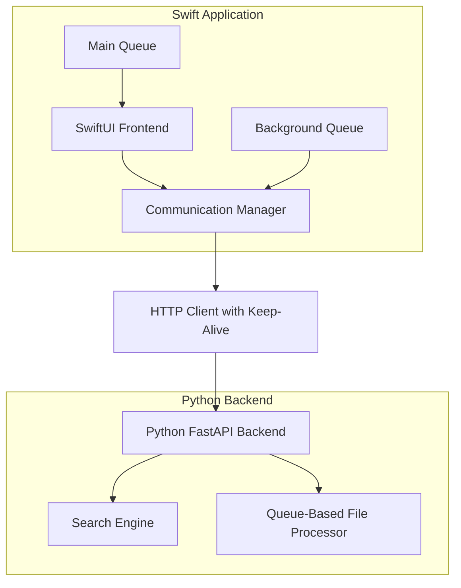
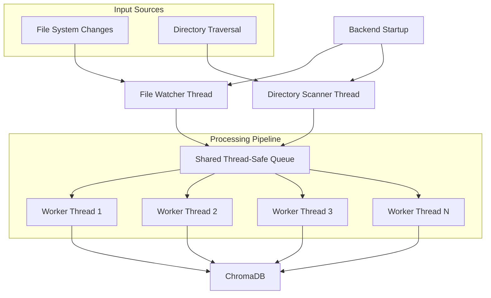

# Design Document

## Overview

The macOS Swift UI application will serve as a native frontend for the existing Python-based file search backend. The design prioritizes minimal latency through efficient inter-process communication (IPC) and asynchronous processing. The architecture separates concerns between the UI layer, communication layer, and the existing backend while maintaining high performance and responsiveness.

## Architecture

### High-Level Architecture



### Queue-Based File Processing Architecture



### Communication Strategy

**Recommended Approach: HTTP with Keep-Alive Connections**

After analyzing the requirements and considering macOS development best practices, HTTP with persistent connections is the optimal choice because:

1. **Simplicity**: Well-established patterns in Swift with URLSession
2. **Reliability**: Built-in error handling and retry mechanisms
3. **Debugging**: Easy to monitor and debug with network tools
4. **Scalability**: Can easily add authentication, load balancing, or multiple backends
5. **Cross-platform**: Works if you later want iOS or web clients

**Backend Modifications Required:**

- Convert existing Python backend to FastAPI or similar async framework
- Add dedicated search endpoints optimized for real-time queries
- Implement connection pooling and keep-alive headers

### Threading Architecture

**Multi-threaded Design for Minimal Latency:**

1. **Main Thread (UI Thread)**:

   - Handle user input events (typing, clicking, key presses)
   - Update UI elements (@Published property changes)
   - Display search results and loading states
   - **Never** perform network requests or JSON processing
   - **Rule**: Any operation taking >16ms should move to background

2. **Background Serial Queue (Search Queue)**:

   - **Purpose**: Handle all search-related network operations
   - **Serial vs Concurrent**: Serial queue ensures requests are processed in order
   - **Operations**:
     - Make HTTP requests to Python backend
     - Deserialize JSON responses into Swift models
     - Cancel previous requests when new search starts
     - Handle network errors and retries
   - **Communication with Main Thread**:
     - Dispatch UI updates back to main queue using `DispatchQueue.main.async`
     - Update @Published properties to trigger SwiftUI re-renders

3. **Example Flow**:

   ```
   User types "hello" → Main Thread captures input
   ↓
   Main Thread dispatches to Background Queue
   ↓
   Background Queue makes HTTP request to Python
   ↓
   Background Queue receives JSON response
   ↓
   Background Queue deserializes to SearchResult objects
   ↓
   Background Queue dispatches back to Main Thread
   ↓
   Main Thread updates @Published results array
   ↓
   SwiftUI automatically re-renders the results list
   ```

4. **Backend Threading Architecture (Python)**:

   **Yes, the entire backend is a separate process from the Swift frontend.**

   **Process Separation**:

   ```
   Swift macOS App Process ←→ HTTP ←→ Python Backend Process
   ```

   **Backend Thread Structure**:

   a) **Main Event Loop Thread (FastAPI/Uvicorn)**:

   - Listens for HTTP requests from Swift frontend
   - Handles routing and request validation
   - **Does NOT** perform actual search or indexing work
   - Dispatches work to appropriate thread pools
   - Returns responses to frontend

   b) **Single Search Thread** (1 thread):

   - **Why Single Thread**: Vector databases (ChromaDB) handle concurrency internally
   - **Database Connection**: Single connection prevents connection pool overhead
   - **Query Serialization**: Ensures queries are processed in order (newer queries can cancel older ones)
   - **Memory Efficiency**: One thread = one set of query processing resources
   - **Simpler Cancellation**: Easy to cancel the current query when a new one arrives
   - Example: `search_executor = ThreadPoolExecutor(max_workers=1)`

   c) **File Watcher Thread** (1 dedicated thread):

   - **Immediate Startup**: Starts monitoring filesystem IMMEDIATELY when backend starts, before any directory scanning
   - **Real-Time Queue Addition**: Adds modified/created/deleted/moved files to the shared processing queue instantly
   - **Concurrent Operation**: Runs simultaneously with directory scanning and worker threads
   - **Unified Pipeline**: All file changes go through the same queue as initial directory scan
   - **No Waiting**: File changes are processed immediately without waiting for initial indexing to complete
   - **Thread Safety**: Uses thread-safe queue operations to add files without blocking other operations

   d) **Directory Scanner Thread** (1 dedicated thread):

   - **Concurrent Scanning**: Traverses entire directory tree while file watcher is already active
   - **Queue Population**: Adds all discovered files to the shared processing queue without processing them
   - **Non-Blocking**: Runs concurrently with file watcher and worker threads
   - **Progress Tracking**: Updates progress based on files discovered vs. queue size and processed count
   - **One-Time Operation**: Completes after full directory traversal, then terminates

   e) **Unified Queue-Based File Processing Architecture**:

   - **Single Thread-Safe Queue**: Central `queue.Queue()` that handles ALL file processing tasks from both directory scan and file watcher
   - **Worker Thread Pool**: Configurable number of worker threads (default: 4) that continuously pull from the shared queue using `queue.get()`
   - **Unified Processing Pipeline**: All files regardless of source (directory scan, file watcher events) go through identical processing
   - **Individual Atomic Commits**: Each worker thread processes one file and commits to ChromaDB immediately using individual transactions
   - **No Batch Processing**: Eliminates batch complexity, reduces memory overhead, provides immediate progress feedback
   - **Thread-Safe Database Access**: ChromaDB handles concurrent access internally; each commit is atomic and isolated
   - **Graceful Shutdown**: Workers check for shutdown signal and complete current file before terminating
   - **Queue Management**: Empty queue means all discovered files processed; workers wait for new items from file watcher
   - Example: `processing_executor = ThreadPoolExecutor(max_workers=4, thread_name_prefix="file-processor")`

   **Threading Flow Examples**:

   _Search Request_:

   ```
   Swift HTTP Request → FastAPI Main Thread → Dispatch to Search Thread → ChromaDB Query → JSON Response
   ```

   _Backend Startup Flow_:

   ```
   Backend Starts → File Watcher Thread (immediate) + Directory Scanner Thread (concurrent)
                 ↓                                    ↓
   File Changes → Shared Thread-Safe Queue ← Directory Files
                 ↓
   Worker Thread Pool (4 threads) → Individual File Processing → Atomic ChromaDB Commits
   ```

   _Real-Time File Change Processing_:

   ```
   File Modified → File Watcher Thread → queue.put(file_path) → Worker Thread → Index & Commit
   ```

   _Directory Scanning Process_:

   ```
   os.walk(directory) → Directory Scanner Thread → queue.put(file_path) → Worker Thread → Index & Commit
   ```

   _Worker Thread Processing_:

   ```
   queue.get() → Extract Content → Generate Embeddings → ChromaDB.upsert() → queue.task_done()
   ```

   **Why This Architecture**:

   - **Process Isolation**: Swift app crash won't affect backend
   - **Thread Separation**: Search never blocks on indexing operations
   - **Scalability**: Can handle multiple concurrent searches
   - **Reliability**: Backend can restart independently
   - **Resource Management**: Each operation type has dedicated resources

## Components and Interfaces

### Swift Application Components

#### 1. SearchView (SwiftUI)

```swift
struct SearchView: View {
    @StateObject private var searchManager = SearchManager()
    @StateObject private var settingsManager = SettingsManager()
    @State private var searchText = ""
    @State private var selectedIndex = 0
    @State private var showingDirectoryPicker = false

    // Real-time search with debouncing
    // Keyboard navigation support
    // Result display and selection
    // Directory selection on first launch
}
```

#### 2. SearchManager (ObservableObject)

```swift
class SearchManager: ObservableObject {
    @Published var results: [SearchResult] = []
    @Published var isSearching: Bool = false
    @Published var connectionStatus: ConnectionStatus = .disconnected
    @Published var indexingProgress: IndexingProgress?

    private let communicationManager = CommunicationManager()
    private let searchQueue = DispatchQueue(label: "search.queue")
    private var currentSearchTask: Task<Void, Never>?

    // Debounced search with cancellation
    // Background processing with main thread updates
    // Indexing progress monitoring
}
```

#### 3. SettingsManager (ObservableObject)

```swift
class SettingsManager: ObservableObject {
    @Published var selectedDirectory: URL?
    @Published var isFirstLaunch: Bool = true

    private let userDefaults = UserDefaults.standard

    // Directory selection and persistence
    // First launch detection
    // Settings management
}
```

#### 3. CommunicationManager

```swift
class CommunicationManager {
    private let session: URLSession
    private let baseURL: URL
    private let decoder = JSONDecoder()

    // Persistent HTTP connections
    // Request queuing and cancellation
    // Error handling with exponential backoff
    // Automatic backend discovery and health checks
}
```

#### 4. BackendDiscovery

```swift
class BackendDiscovery {
    // Auto-detect running Python backend on standard ports
    // Launch backend process if not running
    // Monitor backend health and reconnect
}
```

### Python Backend Modifications

#### 1. FastAPI Application Structure

```python
from fastapi import FastAPI, BackgroundTasks
from fastapi.middleware.cors import CORSMiddleware
import asyncio
import queue
from concurrent.futures import ThreadPoolExecutor

app = FastAPI()

# Single-threaded search executor for ChromaDB queries
search_executor = ThreadPoolExecutor(max_workers=1, thread_name_prefix="search")

# Multi-threaded file processing executor
file_processing_executor = ThreadPoolExecutor(max_workers=4, thread_name_prefix="file-processor")

# Thread-safe queue for file processing tasks
file_processing_queue = queue.Queue()
```

#### 2. Search Endpoint

```python
@app.get("/search")
async def search_files(
    query: str,
    limit: int = 10,
    background_tasks: BackgroundTasks
):
    # Run search on thread
    # Return results with minimal serialization
    # Support request cancellation
```

#### 3. Health and Status Endpoints

```python
@app.get("/health")
async def health_check():
    # Return backend status and indexing progress

@app.get("/status")
async def get_status():
    # Return indexing status, file counts, etc.

@app.post("/set-directory")
async def set_index_directory(request: DirectorySelectionRequest):
    # Validate directory path and permissions
    # Clear existing index and start reindexing
    # Return indexing progress status

@app.get("/indexing-progress")
async def get_indexing_progress():
    # Return current indexing progress with file counts and status
```

## Data Models

### Swift Models

```swift
struct SearchResult: Codable, Identifiable {
    let id = UUID()
    let fileName: String
    let filePath: String
    let score: Double
    let fileType: String
    let lastModified: Date
}

struct SearchRequest: Codable {
    let query: String
    let limit: Int
    let timestamp: Date
}

struct SearchResponse: Codable {
    let results: [SearchResult]
    let totalCount: Int
    let searchTime: Double
    let requestId: String
}

struct IndexingProgress: Codable {
    let isIndexing: Bool
    let currentFile: String?
    let filesProcessed: Int
    let totalFiles: Int
    let progress: Double // 0.0 to 1.0
}

struct DirectorySelectionRequest: Codable {
    let directoryPath: String
}

enum ConnectionStatus {
    case connected
    case connecting
    case disconnected
    case error(String)
}
```

### Communication Protocol

```json
{
  "request": {
    "query": "search term",
    "limit": 10,
    "request_id": "uuid-string"
  },
  "response": {
    "results": [...],
    "total_count": 150,
    "search_time_ms": 45,
    "request_id": "uuid-string"
  }
}
```

## Error Handling

### Connection Management

1. **Automatic Backend Discovery**: Scan common ports (8000, 8080, 3000)
2. **Health Monitoring**: Periodic health checks with exponential backoff
3. **Graceful Degradation**: Show offline state when backend unavailable
4. **Retry Logic**: Exponential backoff for failed requests (100ms, 200ms, 400ms, 800ms)

### Search Error Handling

1. **Request Cancellation**: Cancel in-flight requests when new search starts
2. **Timeout Handling**: 5-second timeout for search requests
3. **Malformed Response**: Graceful handling of invalid JSON responses
4. **Rate Limiting**: Debounce user input to prevent overwhelming backend

### UI Error States

1. **Loading States**: Show spinner during search
2. **Empty States**: Handle no results gracefully
3. **Error Messages**: User-friendly error messages for connection issues
4. **Offline Mode**: Clear indication when backend is unavailable

## Testing Strategy

### Unit Tests

1. **SearchManager Tests**: Mock communication layer, test search logic
2. **CommunicationManager Tests**: Mock network responses, test error handling
3. **Model Tests**: Test JSON serialization/deserialization
4. **Backend Discovery Tests**: Test port scanning and process launching

### Integration Tests

1. **End-to-End Search**: Test complete search flow with real backend
2. **Connection Recovery**: Test reconnection after backend restart
3. **Performance Tests**: Measure search latency under various conditions
4. **Stress Tests**: Test with rapid user input and large result sets

### UI Tests

1. **Search Flow**: Test typing, results display, and file opening
2. **Keyboard Navigation**: Test arrow keys and Enter/Escape handling
3. **Accessibility**: Test VoiceOver and keyboard-only navigation
4. **Window Management**: Test app lifecycle and background behavior

## Performance Optimizations

### Latency Minimization

1. **Connection Pooling**: Reuse HTTP connections with keep-alive
2. **Request Debouncing**: 150ms delay after user stops typing
3. **Result Caching**: Cache recent searches for instant display
4. **Preemptive Cancellation**: Cancel outdated requests immediately

### Memory Management

1. **Result Limiting**: Cap results at 10 items for UI performance
2. **Image Caching**: Cache file type icons efficiently
3. **Background Processing**: Keep heavy operations off main thread
4. **Resource Cleanup**: Properly dispose of network resources

### Backend Threading

1. **Dedicated Search Thread**: Separate thread for search operations
2. **Non-blocking Indexing**: Ensure indexing doesn't block searches
3. **Async I/O**: Use async file operations where possible
4. **Connection Limits**: Limit concurrent connections per client

## Security Considerations

### Local Communication

1. **Localhost Only**: Bind backend to localhost interface only
2. **Port Security**: Use non-standard ports to avoid conflicts
3. **Input Validation**: Sanitize search queries on backend
4. **Resource Limits**: Prevent DoS through rate limiting

### File Access

1. **Sandboxing**: Respect macOS app sandboxing requirements
2. **Permission Requests**: Request file system access appropriately
3. **Path Validation**: Validate file paths before opening
4. **User Consent**: Clear indication of what files are being indexed
