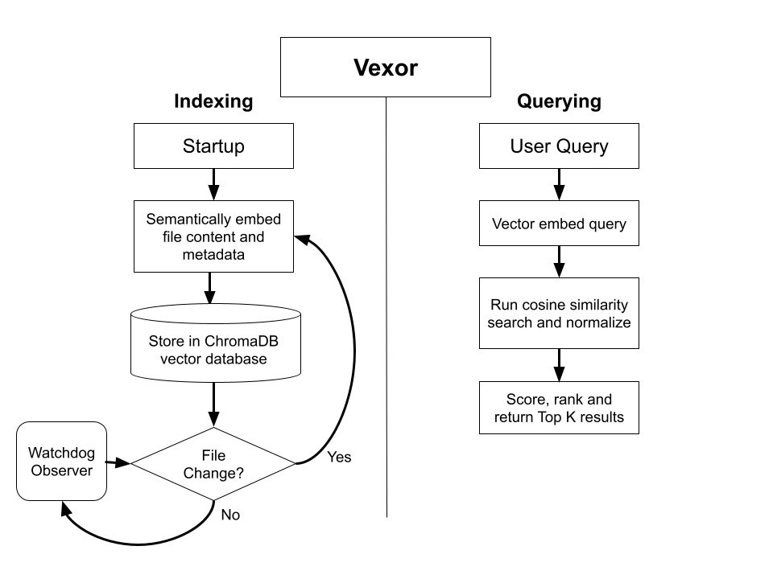

# Vexor - A better way to find files on your computer
Search through your file system using _**natural language**_. Extends the search to your file contents, allowing for more precise and accurate search results. The best part, it all runs locally on your machine, so none of your data leaves your device!

# How it works

### Storage
- Upon startup, the application runs a background process to index all the files in your desired directory into a local **ChromaDb vector database**. (Currently, the directory being used is `/test`. This includes a variety of different 
- The files are split into tables based on their metadata and contents, and each of those are embedded using the **ChromaDB Embedding API**. The file is hashed and used as a key for each entry
  - Future optimization will include additional chunking for large files for additional search granularity, batch indexing by splitting the work over `n` threads to reindex files faster
- There is a separate observer thread running in the background that uses the **Watchdog** library to observe the file system and detect when any files are created, updated, moved, or deleted. This will then invoke the indexer class to either index, reindex, or delete the file entry.

### Querying
- When a user enters a query _(ex, "stories about space")_, it gets vector embedded using the same ChromaDB embedding API, and then is run through a cosine similarity search over both the metadata and content tables
- The results are then scored using a **weighted average and normalization algorithm** that is optimized to maximize matches.
  - Cosine similarity returns a score in the range [0, 2] where 0 = perfectly similar, 1 = orthogonal, 2 = perfectly dissimilar. Using an **inverted sigmoid function** that is scaled and shifted to match the general range of the data, this results in optimal weighing for matches.
- The results are ranked and sorted in descending order based on the % match.
  - Future iterations will include a nice GUI similar to Spotlight search on MAC to allow for fast and intuitive search. 

# How to Run
1. Create a venv to run using `python3.12 -m venv venv`
2. Activate the venv Windows: `venv\Scripts\activate`, Mac: `source venv/bin/activate`
3. Install all the dependencies using `pip install -r requirements.txt`
4. If you want, you can change the root directory indexing directory in `main.py`
5. Run the application `python3 main.py`
6. Once all the files have been indexed, you can type to search through your files using natural language, and it will return the top `k` results.
7. Enjoy!
